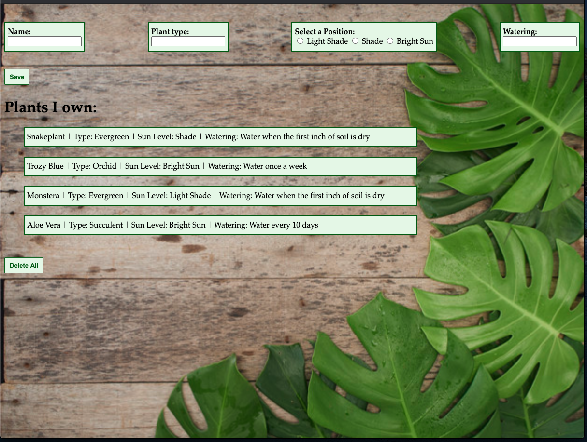

# Manipulating the DOM

## Brief

- Create a front-end JavaScript application that allows users to input items and see them displayed in a list
- Choose a theme for the application
- Users should be able to enter values for different properties relating to the theme and see them displayed below

